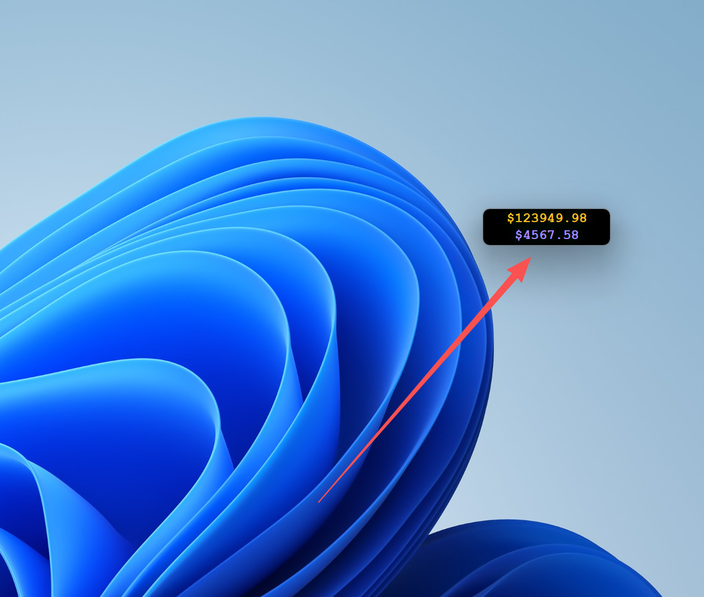

# 💰 Crypto Price Window

<div align="center">

一个基于 **Wails 2** 的极简加密货币价格桌面监控工具

*轻量 · 实时 · 优雅*

[](https://wails.io)
[](https://vuejs.org)
[](https://go.dev)

</div>

---

## 📸 预览

<div align="center">
  
  <p><i>极简的桌面价格监控窗口</i></p>
</div>

一个始终置顶的迷你窗口，实时显示 BTC 和 ETH 的价格，不打扰您的工作流程。

**特点**：
- 🎯 **极简设计** - 100x40 像素超小窗口，只显示核心信息
- 📍 **始终置顶** - 窗口永远在最上层，不会被其他应用遮挡
- 🎨 **优雅配色** - BTC 金色、ETH 紫色，专业的视觉设计
- 🖱️ **可拖拽** - 随意移动到屏幕任意位置
- ⚡ **实时更新** - 标题栏和窗口内容同步显示最新价格

---

## ✨ 功能特性

### 核心功能
- 🔄 **实时价格监控** - 自动从币安 API 获取 BTC 和 ETH 最新价格
- 🪟 **迷你窗口** - 无边框、可拖拽的小窗口设计
- 📊 **双币种显示** - 同时监控 BTC 和 ETH 两种主流币种
- 🔝 **窗口置顶** - 始终显示在所有窗口之上
- 📌 **标题栏同步** - 窗口标题实时显示价格，任务栏可见

### 技术特性
- ⚙️ **灵活配置** - 支持配置文件、环境变量多种配置方式
- 🌐 **代理支持** - 完善的代理配置，国内用户可正常使用
- 🎯 **低资源占用** - Go 后端，内存占用极小
- 🚀 **快速启动** - 毫秒级启动速度
- 📦 **单文件部署** - 编译后仅一个 exe 文件（配置文件可选）

---

## 🛠️ 技术栈

### 后端
- **Go 1.23** - 高性能后端语言
- **Wails v2.10.2** - 跨平台桌面应用框架
- **Binance API** - 币安公开 API 获取实时价格

### 前端
- **Vue 3** - 渐进式 JavaScript 框架
- **Vite** - 下一代前端构建工具
- **现代 CSS** - Flexbox、动画、自定义字体

### 架构设计
```
┌─────────────────┐
│   Vue 3 前端     │  ← 用户界面层
├─────────────────┤
│  Wails Bridge   │  ← JS/Go 通信桥接
├─────────────────┤
│   Go 后端核心    │  ← 业务逻辑层
├─────────────────┤
│  HTTP 客户端     │  ← 网络请求层（含代理）
├─────────────────┤
│  Binance API    │  ← 数据源
└─────────────────┘
```

---

## 🚀 快速开始

### 方式一：直接运行（推荐）

1. **下载应用**
   - [](https://github.com/1415181920/coin_price_monitoring/releases/latest) 获取最新版本(https://github.com/1415181920/coin_price_monitoring/releases) 是已编译的可执行文件
   - 双击即可运行 其他平台的自己下载go编译

2. **配置代理**（国内用户必须）
   - 在 exe 同目录下创建 `config.json` 文件
   - 参考下方[配置章节](#-配置详解)设置代理

3. **启动应用**
   - 双击 `coin_price_window.exe`
   - 稍等片刻即可看到价格显示

### 方式二：开发模式

#### 环境要求
- Go 1.23+
- Node.js 16+
- Wails CLI v2

#### 安装 Wails
```bash
go install github.com/wailsapp/wails/v2/cmd/wails@latest
```

#### 启动开发服务器
```bash
# 克隆项目
git clone <repository-url>
cd coin_price_window

# 启动热重载开发模式
wails dev
```

#### 构建生产版本
```bash
# 构建当前平台
wails build

# 构建 Windows
wails build -platform windows/amd64

# 构建 macOS
wails build -platform darwin/universal

# 构建 Linux
wails build -platform linux/amd64
```

---

## ⚙️ 配置详解

### 配置文件结构

在程序同目录下创建 `config.json`：

```json
{
  "proxy": {
    "enabled": true,
    "address": "http://127.0.0.1:7897"
  },
  "update_interval": 10
}
```

### 配置参数说明

| 参数 | 类型 | 默认值 | 说明 |
|------|------|--------|------|
| `proxy.enabled` | boolean | `true` | 是否启用代理 |
| `proxy.address` | string | `http://127.0.0.1:7897` | 代理服务器地址 |
| `update_interval` | integer | `10` | 价格更新间隔（秒） |

### 代理配置方案

#### 🌟 方案一：配置文件（推荐）

**优点**：
- ✅ 配置持久化，重启后依然有效
- ✅ 修改简单，无需重新编译
- ✅ 适合打包后的 exe 文件

**步骤**：
1. 在 exe 同目录创建 `config.json`
2. 按照上述结构填写配置
3. 重启应用生效

**常用代理端口**：
```
Clash for Windows:  http://127.0.0.1:7897
Clash Verge:        http://127.0.0.1:7890
V2rayN:             http://127.0.0.1:10809
Shadowsocks:        http://127.0.0.1:1080
```

#### 方案二：环境变量

**优点**：
- ✅ 系统级配置，无需配置文件
- ✅ 多个应用共享代理设置

**Windows PowerShell**：
```powershell
# 临时设置（当前会话）
$env:HTTP_PROXY="http://127.0.0.1:7897"
$env:HTTPS_PROXY="http://127.0.0.1:7897"

# 永久设置（用户级）
[System.Environment]::SetEnvironmentVariable("HTTP_PROXY", "http://127.0.0.1:7897", "User")
[System.Environment]::SetEnvironmentVariable("HTTPS_PROXY", "http://127.0.0.1:7897", "User")
```

**Linux/macOS**：
```bash
# 临时设置
export HTTP_PROXY=http://127.0.0.1:7897
export HTTPS_PROXY=http://127.0.0.1:7897

# 永久设置（添加到 ~/.bashrc 或 ~/.zshrc）
echo 'export HTTP_PROXY=http://127.0.0.1:7897' >> ~/.bashrc
echo 'export HTTPS_PROXY=http://127.0.0.1:7897' >> ~/.bashrc
```

#### 方案三：TUN 模式（最简单）

**优点**：
- ✅ 无需任何配置
- ✅ 全局透明代理

**步骤**：
1. 打开 Clash
2. 启用 "TUN Mode" 或 "服务模式"
3. 直接运行应用

### 配置优先级

应用按以下优先级查找代理配置：

```
1. 环境变量 HTTP_PROXY / HTTPS_PROXY
2. 配置文件 config.json
3. 不使用代理（直连）
```

### 验证配置

启动应用后，观察控制台输出：

| 输出信息 | 说明 |
|---------|------|
| `✓ 使用配置代理: http://127.0.0.1:7897` | 代理配置成功 |
| `✓ 使用环境变量代理: http://...` | 使用环境变量代理 |
| `⚠ 未配置代理，直连币安API` | 未配置代理（国内会失败） |
| `✗ 代理地址解析失败` | 代理地址格式错误 |
| `BTC价格: $xxxxx` | 价格获取成功 |
| `获取BTC价格失败` | 网络请求失败 |

---

## 📖 使用指南

### 窗口操作

| 操作 | 说明 |
|------|------|
| **拖拽** | 点击窗口任意位置拖动 |
| **查看价格** | 窗口内显示 BTC 和 ETH 价格 |
| **任务栏** | 标题栏同步显示价格信息 |
| **关闭** | 点击窗口关闭按钮（由于无边框，建议通过任务管理器关闭） |

### 界面说明

```
┌─────────────────┐
│  $xxxxx.xx      │  ← BTC 价格（金色）
│  $xxxx.xx       │  ← ETH 价格（紫色）
└─────────────────┘
```

### 更新频率设置

默认每 10 秒更新一次，可在 `config.json` 中调整：

```json
{
  "update_interval": 5  // 5秒更新一次（更频繁）
}
```

**建议值**：
- 普通监控：10-30 秒
- 交易监控：5-10 秒
- 低频查看：60 秒

---

## 📁 项目结构

```
coin_price_window/
├── main.go                      # 应用入口，Wails 配置
├── app.go                       # 核心业务逻辑
│   ├── 配置加载
│   ├── HTTP 客户端（含代理）
│   ├── 价格获取
│   └── 定时更新
├── config.json                  # 配置文件（可选）
├── go.mod                       # Go 依赖管理
├── go.sum
├── wails.json                   # Wails 项目配置
│
├── frontend/                    # 前端代码
│   ├── src/
│   │   ├── App.vue             # 主界面组件
│   │   ├── main.js             # Vue 入口
│   │   └── style.css           # 全局样式
│   ├── wailsjs/                # Wails 自动生成的绑定
│   │   ├── go/                 # Go 方法绑定
│   │   └── runtime/            # 运行时 API
│   ├── index.html              # HTML 模板
│   ├── package.json            # Node 依赖
│   └── vite.config.js          # Vite 配置
│
├── build/                       # 构建配置
│   ├── darwin/                 # macOS 配置
│   │   ├── Info.plist
│   │   └── Info.dev.plist
│   ├── windows/                # Windows 配置
│   │   ├── icon.ico
│   │   ├── info.json
│   │   └── installer/
│   ├── README.md
│   └── appicon.png             # 应用图标
│
├── README.md                    # 本文件
├── 代理配置说明.md               # 详细代理配置文档
└── coin_price_window.exe       # 编译后的可执行文件
```

### 核心文件说明

#### `main.go` - 应用入口
- Wails 应用初始化
- 窗口配置（大小、位置、样式）
- 前端资源嵌入

#### `app.go` - 业务核心
- **配置管理**：加载 `config.json`
- **代理处理**：支持多种代理配置方式
- **价格获取**：调用币安 API 获取价格
- **定时任务**：按配置间隔更新价格
- **事件发送**：通过 Wails 桥接向前端推送数据

#### `frontend/src/App.vue` - 前端界面
- Vue 3 组合式 API
- 响应式价格显示
- 实时事件监听
- 现代 CSS 样式

---

## 🔧 开发指南

### 项目初始化

```bash
# 克隆项目
git clone <repository-url>
cd coin_price_window

# 安装前端依赖
cd frontend
npm install
cd ..

# 下载 Go 依赖
go mod download
```

### 开发工作流

```bash
# 启动开发模式（热重载）
wails dev

# 前端开发（独立调试）
cd frontend
npm run dev

# 后端测试
go test ./...

# 代码格式化
go fmt ./...
```

### 构建与发布

```bash
# 开发构建（快速）
wails build -debug

# 生产构建（优化）
wails build -clean -ldflags "-w -s"

# 跨平台构建
wails build -platform windows/amd64
wails build -platform darwin/universal
wails build -platform linux/amd64
```

### 自定义开发

#### 添加新币种

1. 修改 `app.go` 添加新币种获取逻辑
2. 修改 `App.vue` 添加显示组件
3. 调整窗口高度以容纳新币种

#### 修改窗口样式

编辑 `main.go` 中的窗口配置：

```go
Width:            100,    // 窗口宽度
Height:           40,     // 窗口高度
AlwaysOnTop:      true,   // 是否置顶
Frameless:        true,   // 无边框
DisableResize:    true,   // 禁止缩放
```

#### 更换 API 源

修改 `app.go` 中的 API URL：

```go
apiURL := fmt.Sprintf("https://api.binance.com/api/v3/ticker/price?symbol=%s", symbol)
```

---

## ❓ 常见问题

### 问题 1：显示 "N/A" 或 "加载中..."

**原因**：无法访问币安 API

**解决方案**：
1. ✅ 检查网络连接
2. ✅ 确认 Clash 等代理工具正在运行
3. ✅ 验证 `config.json` 中的代理地址和端口
4. ✅ 查看控制台输出的代理状态
5. ✅ 尝试在浏览器访问：`https://api.binance.com/api/v3/ticker/price?symbol=BTCUSDT`

### 问题 2：控制台显示 "未配置代理"

**原因**：配置文件不存在或格式错误

**解决方案**：
1. 确认 `config.json` 和 exe 在同一目录
2. 检查 JSON 格式是否正确（使用 JSON 验证工具）
3. 确认没有中文符号（引号、逗号等）
4. 查看[配置文件示例](#配置文件结构)

### 问题 3：EXE 打包后无法使用

**原因**：配置文件未与 exe 一起分发

**解决方案**：
1. 将 `config.json` 复制到 exe 同目录
2. 或使用环境变量配置代理
3. 或开启 Clash TUN 模式

### 问题 4：如何找到 Clash 端口

**步骤**：
1. 打开 Clash 主界面
2. 点击 "Settings" / "设置"
3. 找到 "Port" / "端口" 配置
4. HTTP 端口通常是 7890 或 7897

### 问题 5：价格更新太慢/太快

**解决方案**：
修改 `config.json` 中的 `update_interval`：

```json
{
  "update_interval": 5  // 改为 5 秒
}
```

### 问题 6：窗口无法移动

**原因**：未启用拖拽区域

**解决方案**：
检查 `App.vue` 中是否有：

```css
.container {
  --wails-draggable: drag;
}
```

---

## 🧪 测试代理连接

### 方法 1：控制台日志

启动应用后，查看输出：

```
已加载配置文件 config.json
✓ 使用配置代理: http://127.0.0.1:7897
✓ 价格更新间隔: 10秒
BTC价格: $95234.12
ETH价格: $3421.45
```

### 方法 2：浏览器测试

确保 Clash 运行后，访问：
```
https://api.binance.com/api/v3/ticker/price?symbol=BTCUSDT
```

能看到 JSON 数据说明代理正常。

### 方法 3：命令行测试

**Windows PowerShell**：
```powershell
$env:HTTP_PROXY="http://127.0.0.1:7897"
curl https://api.binance.com/api/v3/ticker/price?symbol=BTCUSDT
```

**Linux/macOS**：
```bash
export HTTP_PROXY=http://127.0.0.1:7897
curl https://api.binance.com/api/v3/ticker/price?symbol=BTCUSDT
```

---

## 📝 更新日志

### v1.0.0（当前版本）
- ✅ 支持 BTC 和 ETH 双币种监控
- ✅ 完善的代理配置系统
- ✅ 极简窗口设计
- ✅ 实时价格更新
- ✅ 跨平台支持（Windows、macOS、Linux）

---

## 🤝 贡献指南

欢迎贡献代码！请遵循以下步骤：

1. Fork 本仓库
2. 创建特性分支：`git checkout -b feature/AmazingFeature`
3. 提交更改：`git commit -m 'Add some AmazingFeature'`
4. 推送分支：`git push origin feature/AmazingFeature`
5. 提交 Pull Request

### 开发规范

- 遵循 Go 官方代码规范
- 使用 `go fmt` 格式化代码
- 编写单元测试
- 更新相关文档

---

## 📄 许可证

本项目采用 MIT 许可证 - 详见 LICENSE 文件

---

## 🙏 致谢

- [Wails](https://wails.io) - 优秀的跨平台框架
- [Vue.js](https://vuejs.org) - 渐进式前端框架
- [Binance API](https://binance-docs.github.io/apidocs/) - 免费的加密货币数据

---

<div align="center">

**如果这个项目对你有帮助，请给个 ⭐ Star！**

*Powered by Wails + Vue 3 + Go*

</div>
